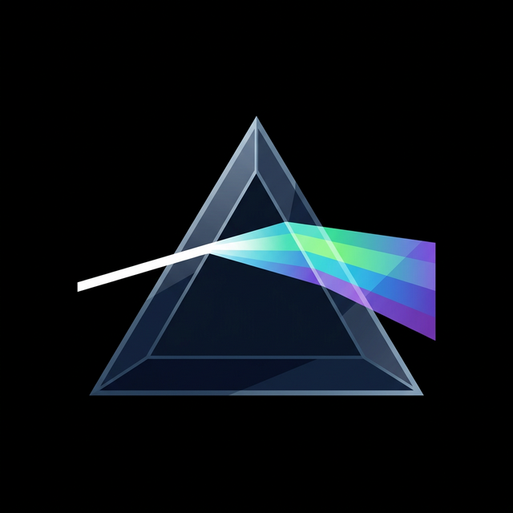
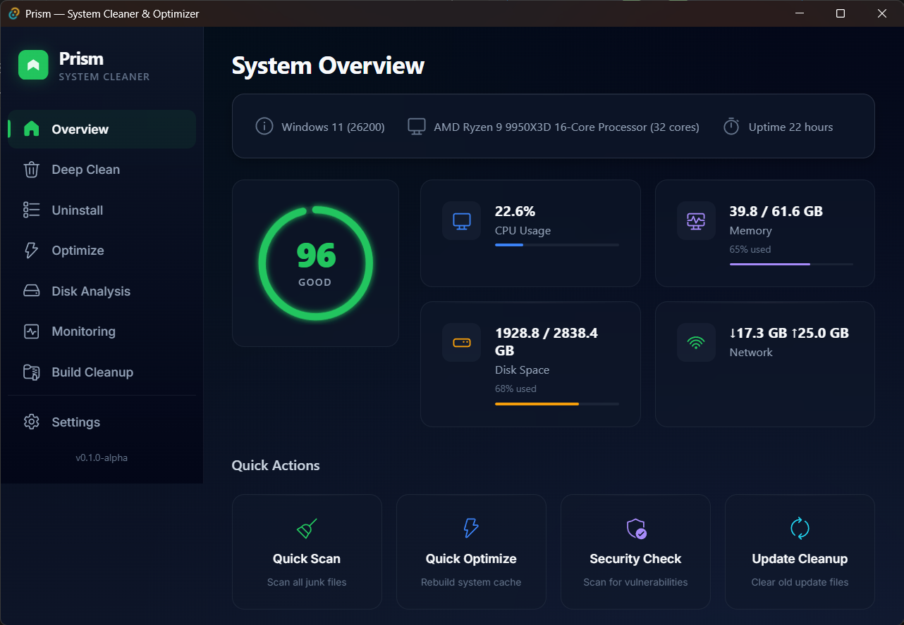
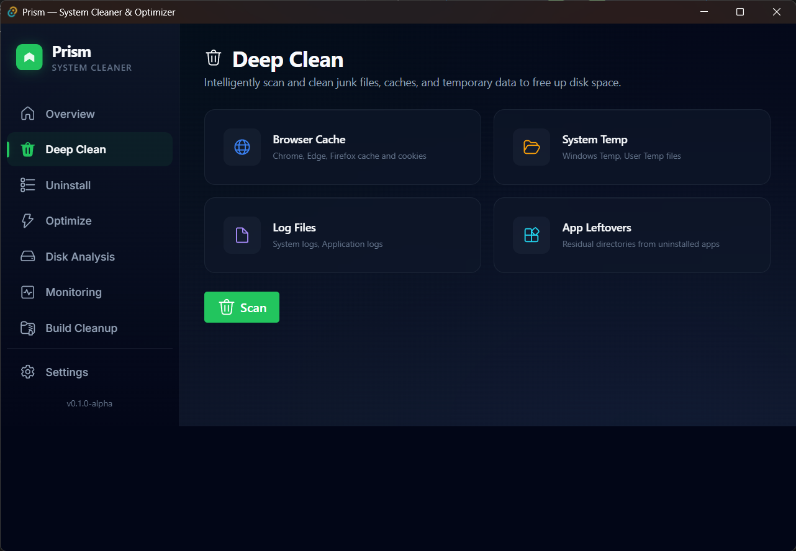
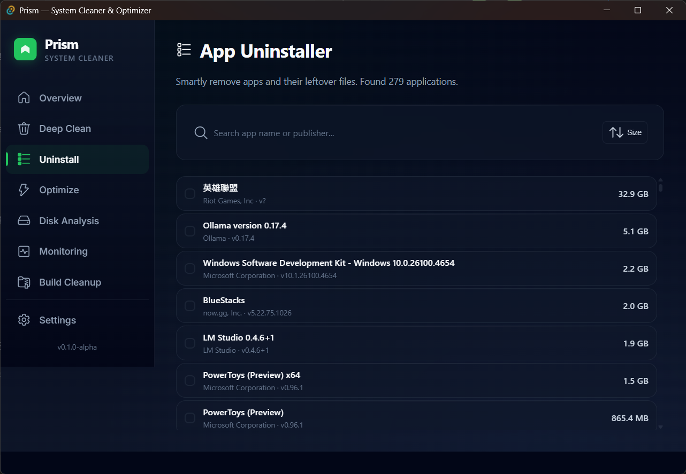
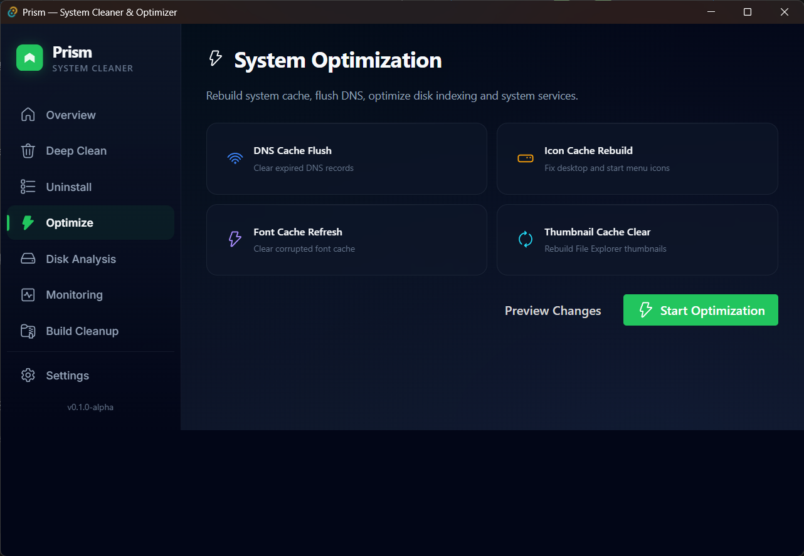
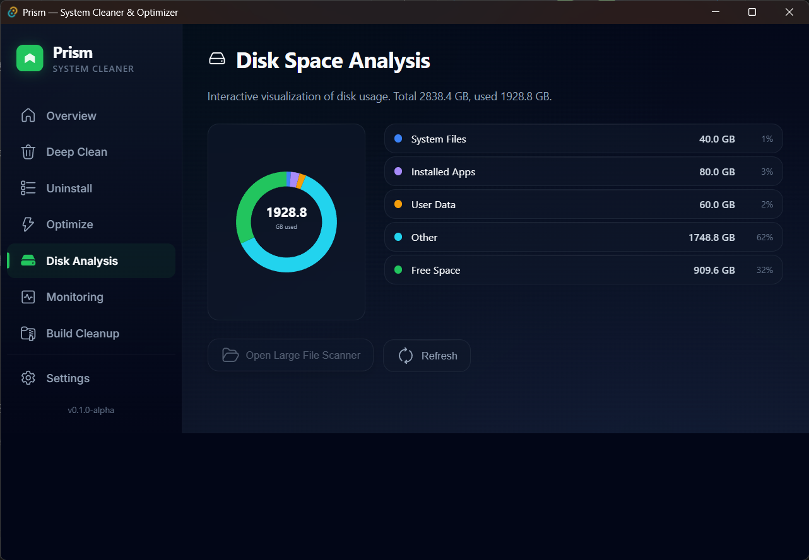
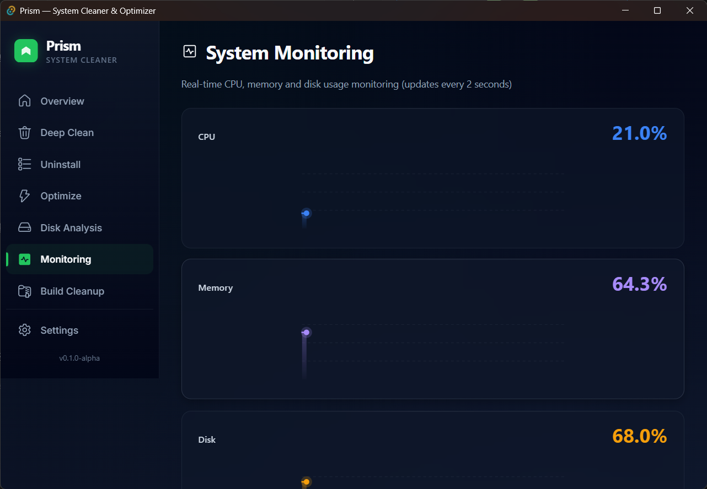
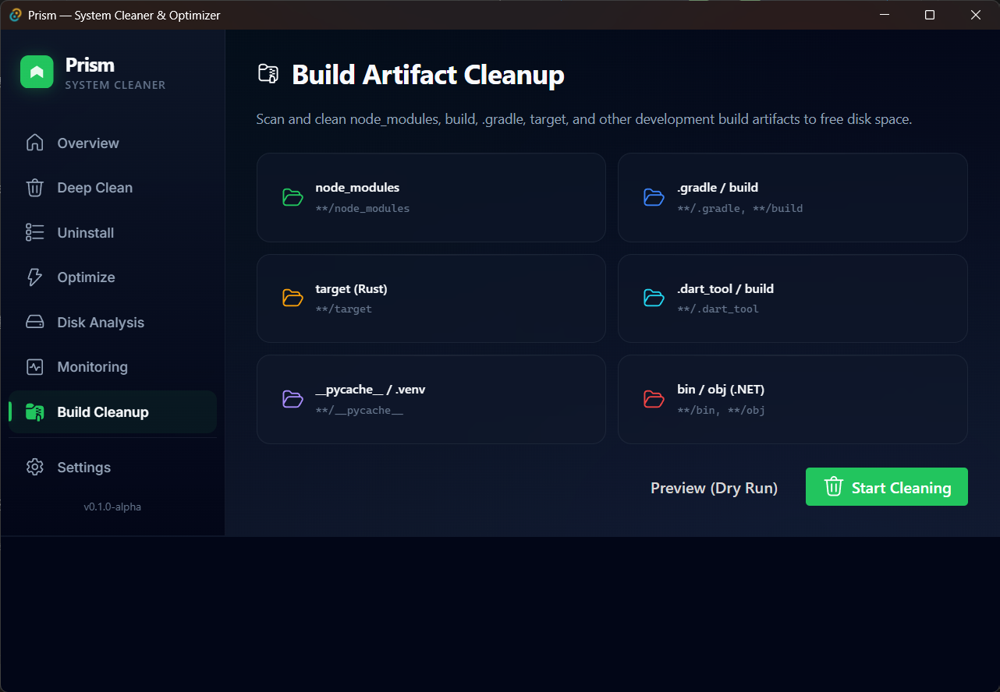
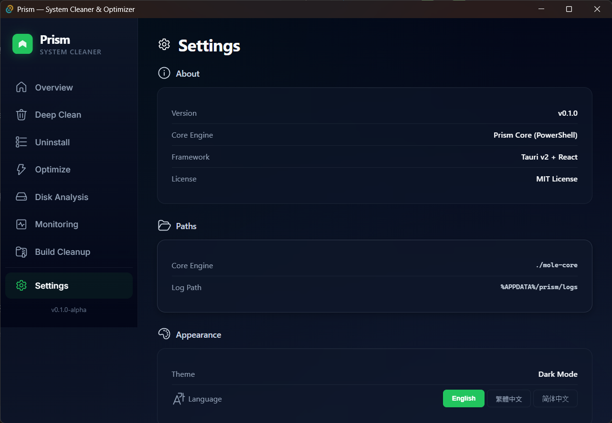

<div align="center">



# Prism

**現代化、精美的 Windows 系統清理與優化工具**

採用 [Tauri v2](https://tauri.app/) + [React](https://react.dev/) + [Fluent UI](https://react.fluentui.dev/) 打造

[](LICENSE)


[English](README.md) | [简体中文](README.zh-CN.md)



</div>

---

## ✨ 功能特色

| 模組 | 說明 |
|------|------|
| 📊 **系統總覽** | 即時監控 CPU、記憶體、磁碟、網路，並提供健康分數 |
| 🧹 **深度清理** | 掃描並清除瀏覽器快取、暫存檔、日誌和應用殘留 |
| 📦 **解安裝** | 智慧移除程式，支援依大小排序與批次解安裝 |
| ⚡ **系統優化** | 刷新 DNS、重建圖示 / 字型 / 縮圖快取 |
| 💽 **磁碟分析** | 互動式圓環圖視覺化磁碟使用量 |
| 📈 **系統監控** | 即時 CPU / 記憶體 / 磁碟圖表，每 2 秒更新 |
| 🗑️ **構建清理** | 清除 `node_modules`、`.gradle`、`target`、`__pycache__` 等開發產物 |
| 🌐 **多語系** | 支援 English、繁體中文、简体中文，自動偵測系統語言 |

## 🖼️ 截圖展示

<details>
<summary>點擊展開所有截圖</summary>

| 功能 | 截圖 |
|------|------|
| 深度清理 |  |
| 解安裝 |  |
| 系統優化 |  |
| 磁碟分析 |  |
| 系統監控 |  |
| 構建清理 |  |
| 設定 |  |

</details>

## 🚀 快速開始

### 前置需求

- [Node.js](https://nodejs.org/) 18+
- [Rust](https://www.rust-lang.org/tools/install)（穩定版）
- [Tauri CLI 前置安裝](https://v2.tauri.app/start/prerequisites/)

### 開發模式

```bash
# 複製專案
git clone https://github.com/YourUsername/prism.git
cd prism

# 安裝相依套件
npm install

# 啟動開發伺服器
npm run tauri dev
```

### 打包構建

```bash
# 構建正式安裝檔
npm run tauri build
```

安裝檔會輸出至 `src-tauri/target/release/bundle/`。

## 🏗️ 技術棧

| 層級 | 技術 |
|------|------|
| 前端 | React 18 + TypeScript + Vite |
| UI 元件 | Fluent UI React v9 |
| 後端 | Rust + Tauri v2 |
| 核心引擎 | PowerShell 腳本 |
| 國際化 | react-i18next |
| 樣式 | 自訂 CSS（毛玻璃風格） |

## 📁 專案結構

```
prism/
├── src/                    # React 前端
│   ├── components/         # 可重用 UI 元件
│   ├── pages/              # 頁面元件
│   ├── hooks/              # 自訂 React Hooks
│   ├── i18n/               # 國際化
│   │   ├── i18n.ts         # i18next 設定
│   │   └── locales/        # 翻譯檔 (en, zh-TW, zh-CN)
│   ├── App.tsx             # 根元件
│   └── main.tsx            # 入口點
├── src-tauri/              # Rust 後端
│   ├── src/
│   │   ├── commands/       # Tauri 指令處理
│   │   └── lib.rs          # 插件註冊
│   ├── Cargo.toml
│   └── tauri.conf.json
├── mole-core/              # PowerShell 核心腳本
└── package.json
```

## 🤝 貢獻指南

歡迎提交 Pull Request！

1. Fork 此專案
2. 建立功能分支（`git checkout -b feature/amazing-feature`）
3. 提交變更（`git commit -m 'Add amazing feature'`）
4. 推送至分支（`git push origin feature/amazing-feature`）
5. 開啟 Pull Request

## 🙏 致謝

- **[Mole](https://github.com/nicholasgasior/mole)** by [tw93](https://github.com/tw93) — 驅動 Prism 清理與優化功能的開源 PowerShell 核心引擎（MIT 授權）
- **[Tauri](https://tauri.app/)** — 輕量安全的桌面應用程式框架
- **[Fluent UI](https://react.fluentui.dev/)** — Microsoft 的 React 設計系統
- **[react-i18next](https://react.i18next.com/)** — 國際化框架

完整第三方授權清單請見 [THIRD_PARTY_LICENSES.md](THIRD_PARTY_LICENSES.md)。

## 📄 授權

本專案採用 MIT 授權 — 詳見 [LICENSE](LICENSE)。
